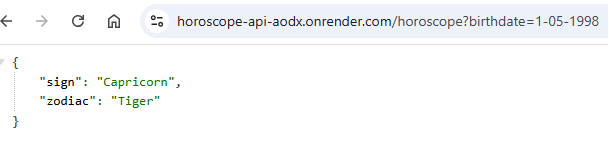
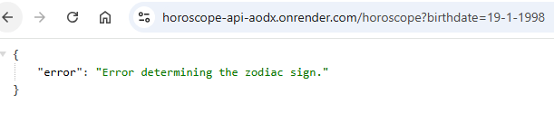

# Horoscope API 🌟

Horoscope API est une application backend construite avec Express.js permettant de déterminer votre signe astrologique occidental et votre signe du zodiaque chinois à partir de votre date de naissance, deployée sur render.com

---

## 🚀 Fonctionnalités de l'API

**Baseurl**: https://horoscope-api-aodx.onrender.com/

### Endpoints disponibles :

#### **`GET /`**
  Cet endpoint permet d'afficher un message welcome !

#### **`GET /horoscope`**
- **Description :**
  Cet endpoint permet de récupérer :
  - Votre **signe astrologique** basé sur votre mois et jour de naissance.
  - Votre **signe du zodiaque** basé sur votre année de naissance.

- **Paramètres requis :**
  - `birthdate` : Une date de naissance au format `YYYY-MM-DD` ou `MM/DD/YYYY` ou `DD-MM-YYYY`.

